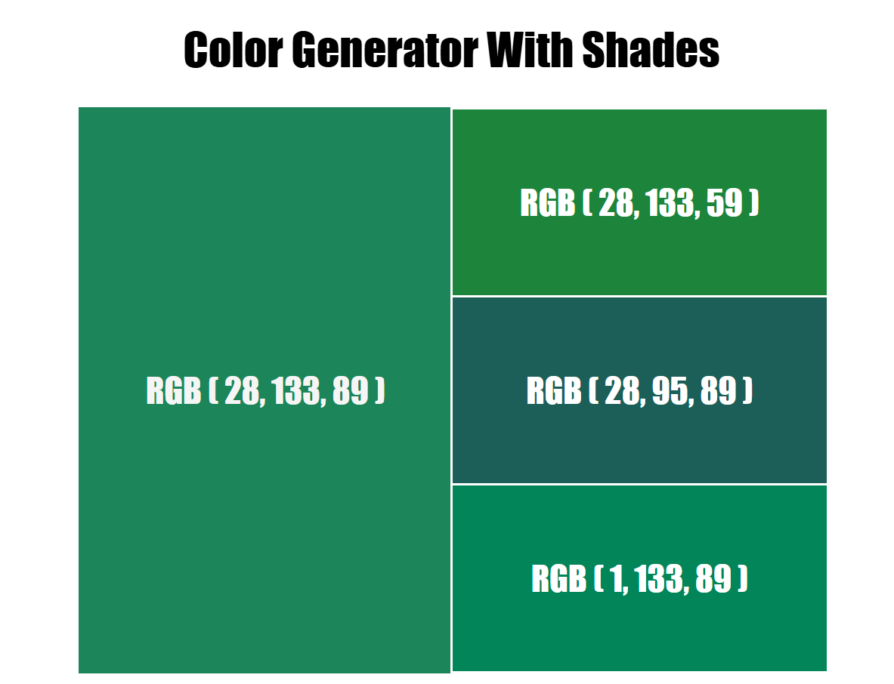
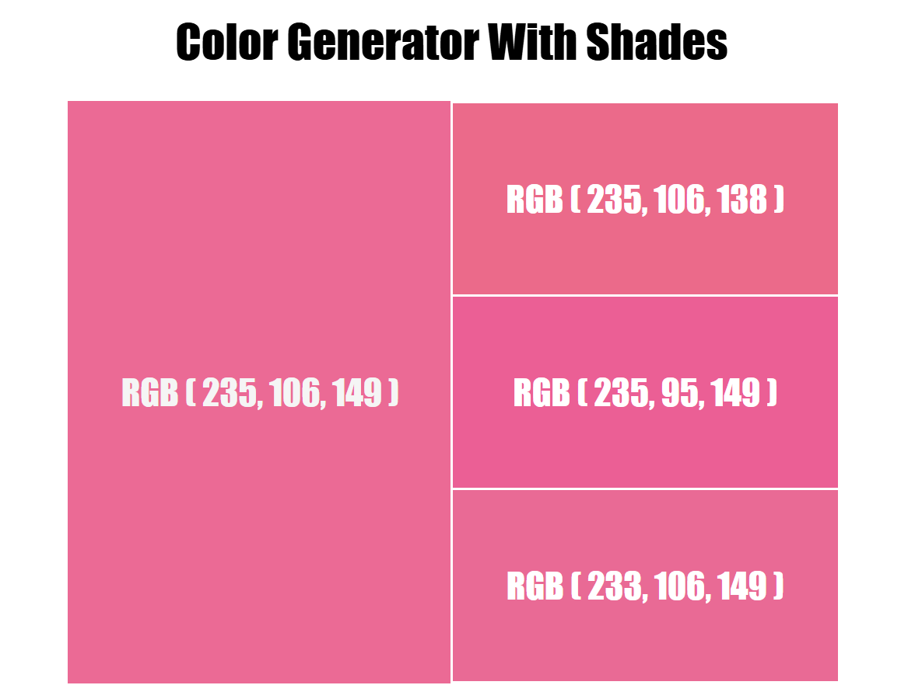

# 🎨 Color Generator with Shades

A clean, simple, and interactive web tool to generate a random base color and explore its lighter and darker shades. Perfect for web designers, developers, and creatives seeking color inspiration on the fly.

---

## 🌈 Features

- 🎲 Generate a random base color
- 🌗 Display a range of lighter and darker shades
- ⚡ Simple and fast – no frameworks required
- 🧑‍💻 Beginner-friendly code structure
- 📱 Fully responsive layout

---

## 🚀 Live Demo

👉 https://muzamilalisuleman.github.io/COLOR_GENERATOR_WITH_SHADES/

---

## 🧰 Tech Stack

- **HTML5** – For markup and structure
- **CSS3** – For styling and responsiveness
- **JavaScript (Vanilla)** – For color logic and DOM interactions

---

## 🖼️ Preview

Here’s a sneak peek of the app:

| Color Generator | Shade Display |
|-----------------|----------------|
|  |  |

---
## 📚 Learning Goals

This project is great for:

- 🧑‍💻 Practicing basic web development with HTML, CSS, and JavaScript.
- 🌀 Understanding CSS animations and transitions.
- 🎨 Exploring interactive front-end design concepts.

## 🤝 Contributing

Feel free to fork this repo and submit a pull request if you'd like to contribute!

## 📜 License

This project is open-source and free to use.

---

Made with ❤️ by [MUZAMIL ALI SULEMAN](https://github.com/MUZAMILALISULEMAN)

